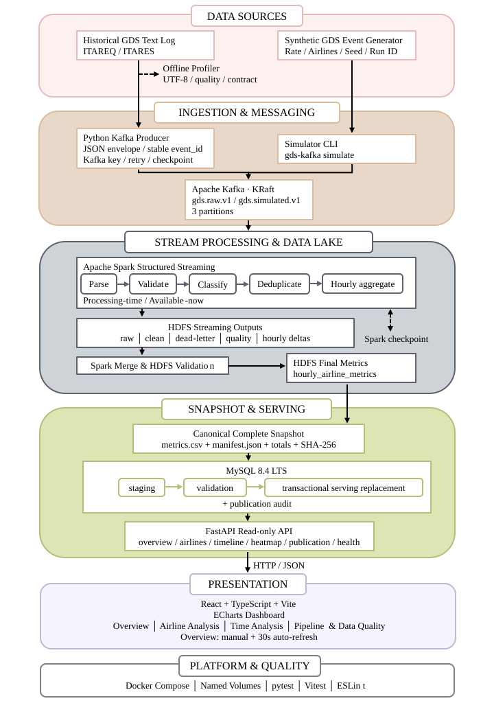
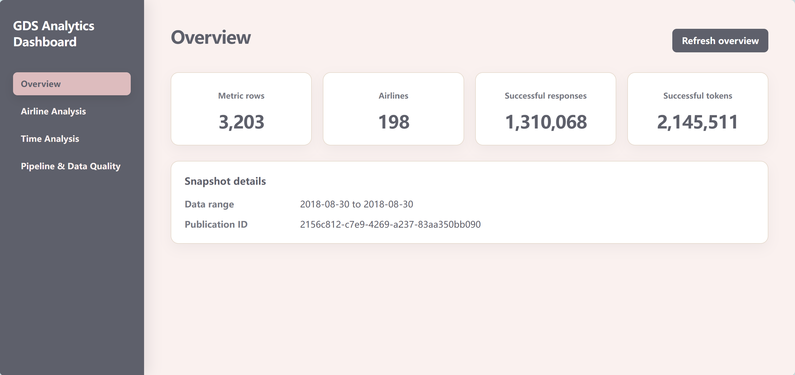
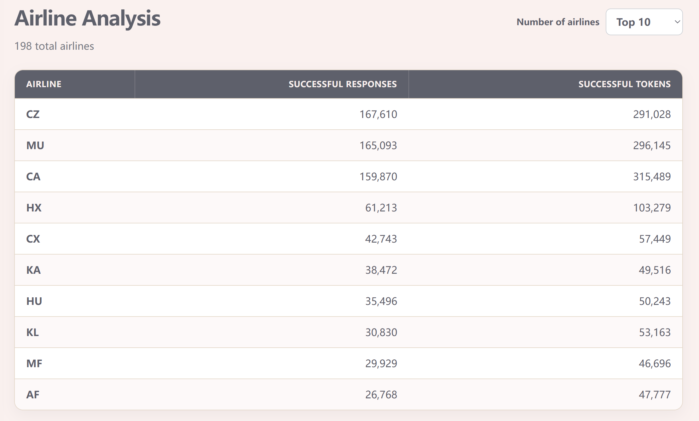
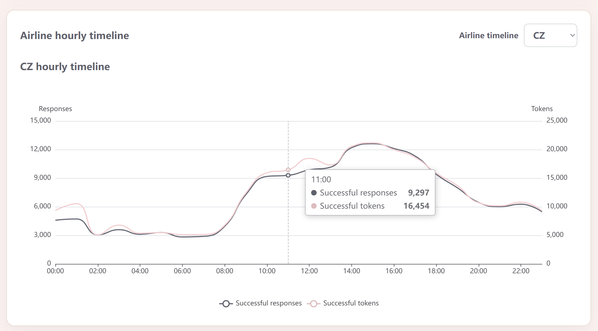
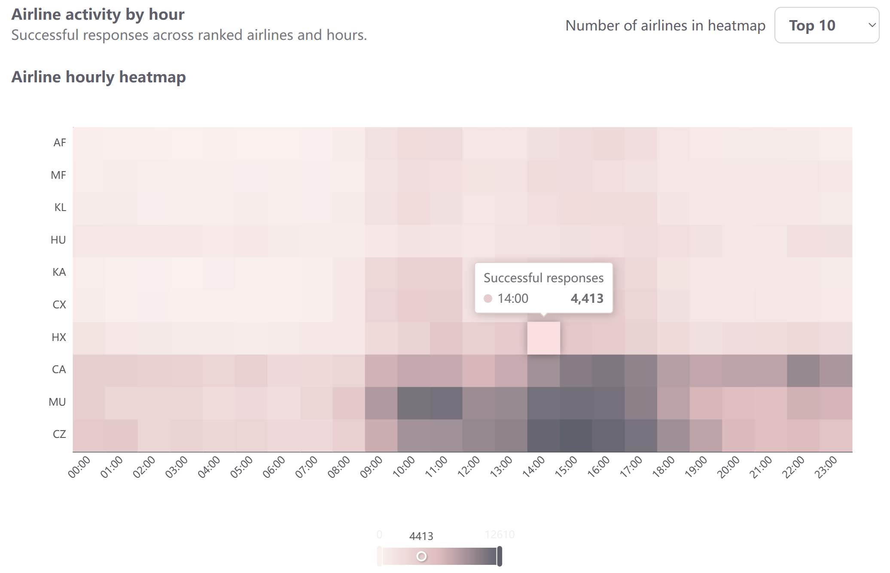

<h1 align="center">Real-time GDS Booking Log Analytics Pipeline</h1>


The pipeline ingests GDS events through Kafka, processes and aggregates them
with Spark Structured Streaming, stores durable outputs in HDFS, publishes
validated snapshots to MySQL, and exposes the results through a FastAPI-powered
analytics dashboard.

> The live demo uses system-generated synthetic GDS events rather than traffic
> collected from a production airline system.

## Architecture

<p align="center">
  
</p>

## Run locally

### Requirements

- Windows 10/11 with WSL2
- Docker Desktop with WSL integration enabled
- Python 3.11 or later
- Node.js 22.22.2 through `nvm`
- Git

### 1. Clone the repository

```bash
git clone https://github.com/kayshen18/gds-streaming-analytics.git
cd gds-streaming-analytics
```

### 2. Install the Python dependencies

```bash
python3 -m venv .venv
source .venv/bin/activate

python -m pip install --upgrade pip
python -m pip install -e '.[dev,spark,mysql,api]'
```

### 3. Install the frontend dependencies

```bash
cd frontend
nvm use
npm ci
cd ..
```

### 4. Configure MySQL

```bash
cp infrastructure/mysql/.env.example infrastructure/mysql/.env
nano infrastructure/mysql/.env
```

Replace the example passwords in `.env` with local development passwords.
The real `.env` file is ignored by Git and must not be committed.

### 5. Start the infrastructure

Make sure Docker Desktop is running, then execute:

```bash
bash scripts/kafka-up.sh
bash scripts/bigdata-up.sh
bash scripts/mysql-up.sh
```

Create the synthetic demo topic if it does not already exist:

```bash
docker exec gds-kafka \
  /opt/kafka/bin/kafka-topics.sh \
  --bootstrap-server localhost:29092 \
  --create \
  --if-not-exists \
  --topic gds.simulated.v1 \
  --partitions 3 \
  --replication-factor 1
```

### 6. Publish demo analytics data

```bash
bash scripts/live-demo-refresh.sh \
  --iterations 1 \
  --events-per-cycle 100 \
  --rate 10
```

This command generates synthetic GDS events and processes them through Kafka,
Spark Structured Streaming, HDFS, and MySQL.

### 7. Start the FastAPI backend

Open a new WSL terminal in the repository root:

```bash
source .venv/bin/activate

set -a
source infrastructure/mysql/.env
set +a

python -m uvicorn \
  gds_pipeline.api.main:create_runtime_app \
  --factory \
  --host 127.0.0.1 \
  --port 8000
```

Keep this terminal running.

### 8. Start the React frontend

Open another WSL terminal:

```bash
cd frontend
nvm use

npm run dev -- --host 0.0.0.0
```

Keep this terminal running, then open:

```text
http://localhost:5173
```

The FastAPI documentation is available at:

```text
http://127.0.0.1:8000/docs
```

## Dashboard

<p align="center">
  
</p>

<p align="center">
  
</p>

<p align="center">
  
</p>

<p align="center">
  
</p>

The dashboard includes overview metrics, airline rankings, airline and
system-wide hourly timelines, an airline activity heatmap, and publication
health information.
